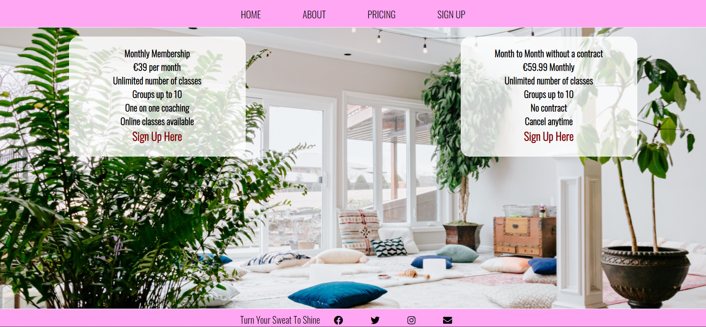

Best Yoga Studio is a site for a new up and coming chic and urban yoga studio located in X. The sites aim primarily is to give more information about Best Yoga studio with hours of operation, two different pricing options and a contact form.

# Features

## Existing Features

### Navigation Bar

<li>Featured on all four pages, the full responsive navigation bar as I had used and activated the flex to make my work a bit easier for me includes links to the Home page, Abour, Pricing and Sign Up/contact page and is identical in each page to allow for easy navigation. It has a hover effect of changing colors and adding un underline as well as scaling up to add a modern effect to it.</li>

### The landing page

<li>The landing includes a photograph of a young lady doing a yoga pose with text overlay to inspire the user to sign up easily.</li>

<li>This page has a link you can click to take you to the sign up page as well as a paragraph about the studio's ethos</li>

<li>Main section on home page includes the name of the business and a link that takes you to a sign up page and it is for a promotion studio is doing.
Link has a hover effect of scaling up for a modern effect.</li>

### About Page

<li>This section includes a video about history of Stretch yoga studio as well as a section with testimonials, hours of operation and a google map of the place</li>

<li>User has to press play on the link to play the video and turn up the volume manually</li>

<li>This page also includes two images of people doing yoga</li>

### Pricing Page 

<li>This section includes a picture of the inside of the studio with two different payment options</li>

<li>The payment option windows have price listed with SIGN UP NOW a tag which on hover scales up and changes color and when clicked takes you to the next page which is Sign up</li>

### Sign up page

<li>This page has a beautiful background of the studios users doing the yoga out on the beach</li>

<li>Page features a sign up form which has no labels but rather I decided to use placeholders for the clean look. It also has two radio buttons for two different plans</li>

<li>Submit button has a hover effect where text changes color and scales up for modern effect</li>

### Footer 

<li>The footer section includes links to the relevant social media sites for Love Running. The links will open to a new tab to allow easy navigation for the user.</li>

 

The Footer

The footer section includes links to the relevant social media sites and an direct email for Best Yoga Studio. The footer is identical on all four different pages of BYS site. The links will open to a new tab to allow easy navigation for the user.
The footer is valuable to the user as it encourages them to keep connected via social media.
Footer

About

The about page provides visitors with information about hours of operation and a informative video about BYS as well as the testimonials.

Pricing page provides users with two different pricing options subject to change in the future as one of the options is a promo that the studio is doing to attract new clients during winter months. Clicking on the Sign up here takes the user to the contact page.

Contact page

This page will allow the user to get signed up. The user will be able specify if they would like to take part normal pricing or winter months promo. The user will be asked to submit their full name and email address. I have decides against using the labels because I think it looks cleaner without it.

Testing
In this section, you need to convince the assessor that you have conducted enough testing to legitimately believe that the site works well. Essentially, in this part you will want to go over all of your project’s features and ensure that they all work as intended, with the project providing an easy and straightforward way for the users to achieve their goals.

In addition, you should mention in this section how your project looks and works on different browsers and screen sizes.

If this section grows too long, you may want to split it off into a separate file and link to it from here.

Validator Testing
HTML test with https://validator.w3.org/
No errors were returned when passing through the official W3C validator
CSS https://validator.w3.org/
No errors were found when passing through the official (Jigsaw) validator
Unfixed Bugs
None

Deployment
This section should describe the process you went through to deploy the project to a hosting platform (e.g. GitHub)

The site was deployed to GitHub pages. The steps to deploy are as follows:
In the GitHub repository, navigate to the Settings tab
From the source section drop-down menu, select the Master Branch
Once the master branch has been selected, the page will be automatically refreshed with a detailed ribbon display to indicate the successful deployment.
The live link can be found here - https://code-institute-org.github.io/love-running-2.0/index.html

Credits

Media:

[Home page pic](https://unsplash.com/photos/I2YSmEUAgDY)
About page pic link: https://unsplash.com/photos/rX8gBeg2WM0
Pricing page pic link: https://unsplash.com/photos/3jztLhBPrUo
Sign Up page pic link: https://unsplash.com/photos/GaprWyIw66o
Video link: https://www.youtube.com/watch?v=qnxzm6gngXA

Content:
The content used is all done by me with taking inspiration from several websites.
